# *AREP - Laboratorio 7*
# Amazon Gateway y Lambda

## Integrantes:

- James Alexander Torres

## Use Maven, Circle CI, AWS, Docker, GIT and GITHUB.
Cree un servicio Web en Spark que convierta de grados farenheit en grados celcius. El servicio debe responder un JSON.
Despliegue el servicio en una máquina de AWS EC2 y publíquelo.
Cree una ruta en el API getway para acceder al servicio . Ojo ya la integración no es con función lambda.
Cree un aplicación JS para usar el servicio. Depliegue la aplicación en S3. Asegúrese que esté disponible sobre internet.
Pruebe la aplicación Web
Entregue el código desarrollado en Github, un reporte de las pruebas, y u video con el experimento funcionando.
Intente que el servicio en EC2 no esté accesible sobre internet, solo debe estar accesible por medio del API gateway.

## Despliegue 
[](https://circleci.com/gh/JamesTorres99/laboratorio-AREP-7)

**Compilar el proyecto con maven**
```
mvn package
```

**Ejecutar el proyecto con maven**
```
java -cp target/classes;target/dependency/* edu.escuelaing.arep.App

```

**Ejecutar pruebas del proyecto con maven**
```
mvn test
```

**Obtener Documentacion del proyecto con maven**

El ejecutable de javadoc "index.html" se encuentra en target\site\apidocs al ejecutar el siguiente comando:
```
mvn javadoc:javadoc
```

**Ejecutando el programa**

debe usar el comando desde el directorio raíz usando Docker ToolBox
```
docker-compose up -d --scale web=3
```

##  Creación de un Rol en IAM

Iniciamos con la creacion de la funcion Lambda con su respectiva API, primero crearemos un nuevo rol seleccionando en el dashboard *IAM* y en seguida seleccionamos la opcion *Roles* y crear nuevo rol.

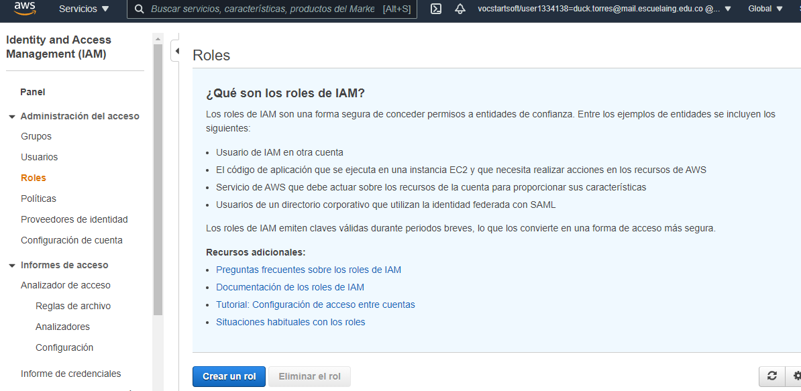

Seleccionamos la opcion *Lambda* y despues en siguiente: permisos

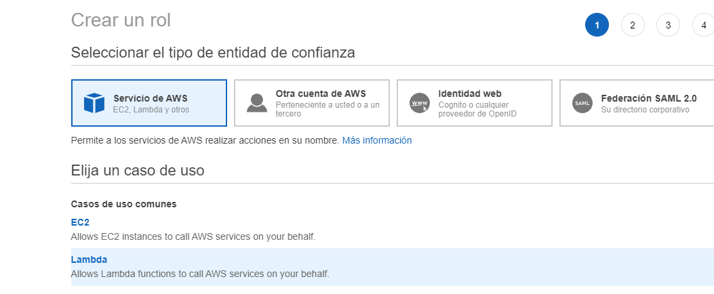

Despues solo seleccionaremos las politicas *AdministratorAccess* y de nuevo en siguiente: Etiquetas y siguiente Siguiente: Revisar.

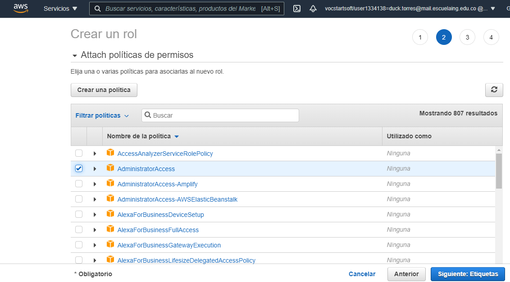

Daremos aqui el nombre del rol y acontinuacion presionamos el boton de *crear un rol*

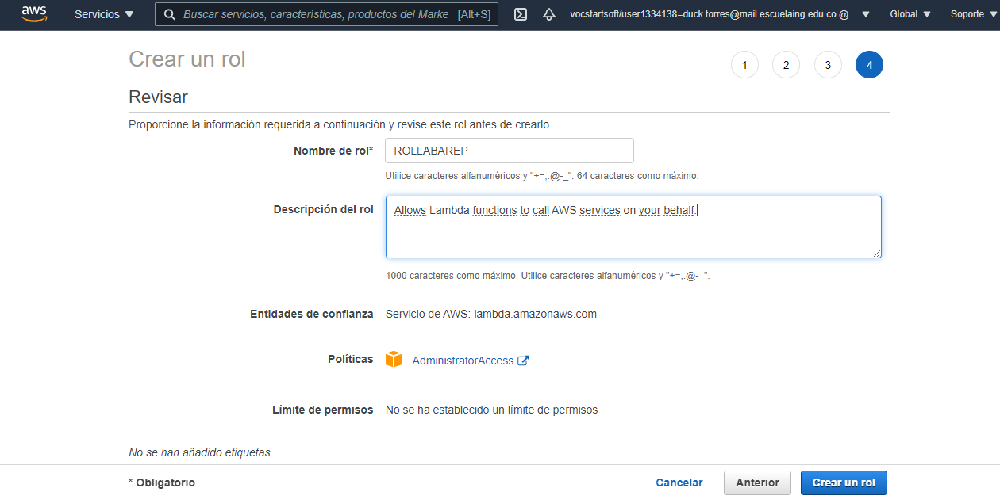

Por ultimo revisaremos si todo esta correcto.

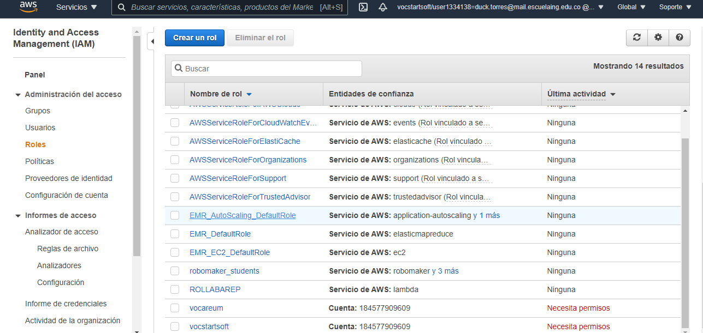

##  Creación de funcion Lambda

Iniciamos con la creacion de la funcion Lambda seleccionando en el dashboard *Lambda* y en seguida seleccionamos la opcion *crear una nueva funcion*

se colocara el nombre de la funcion usada con su respectivo java 8, justo despues en rol de ejecucion seleccionaremos uso de rol existente y pondremos el rol creado anteriormente.

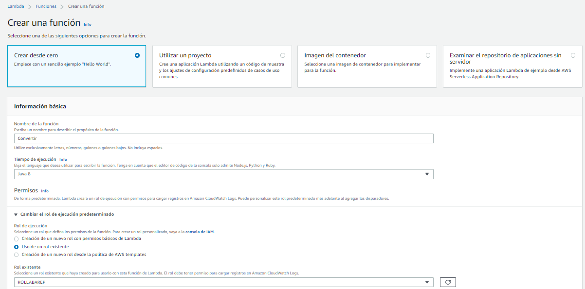}

Caragremos nuestro .jar localizado en target en nuestro proyecto

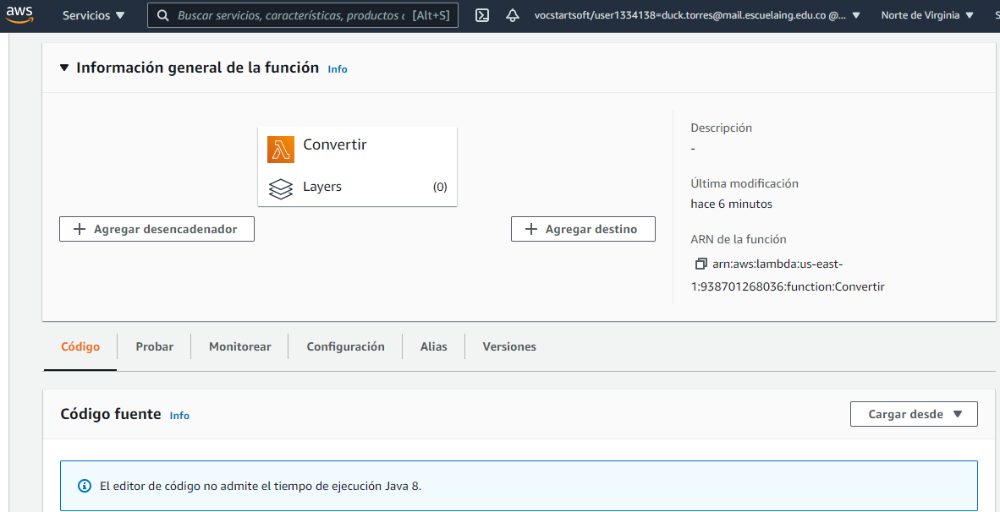

Editaremos el tiempo de ejecucion colocando la direccion de nuestra clase en donde estara el metodo de convertir.

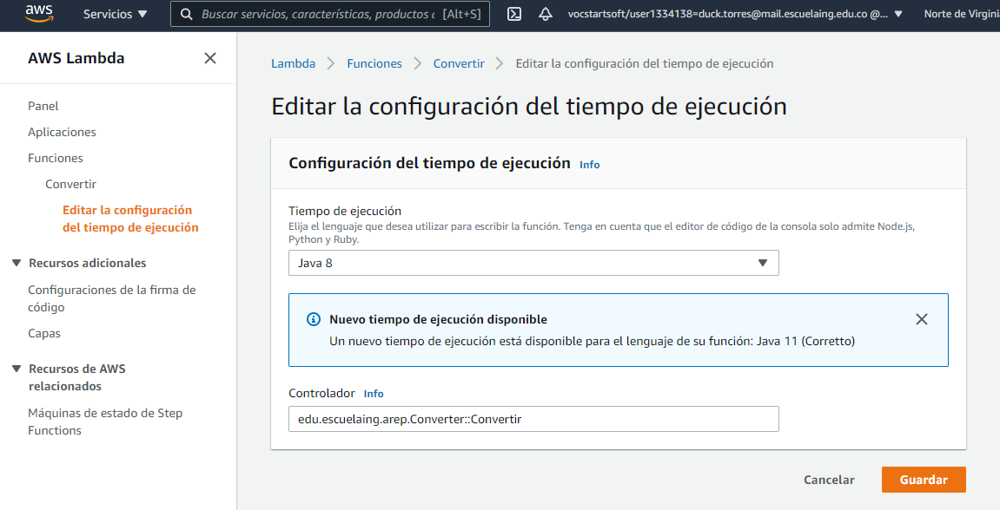

creamos un evento de prueba para visualizar su funcionamiento

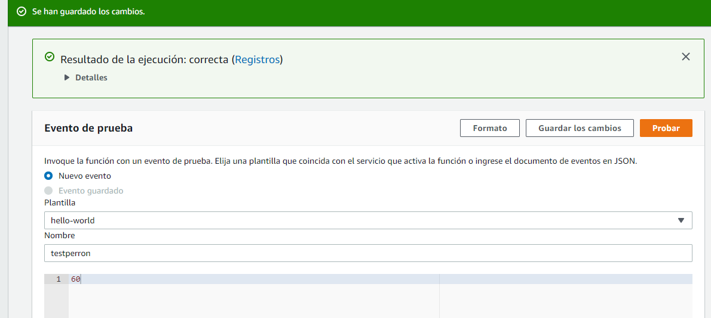

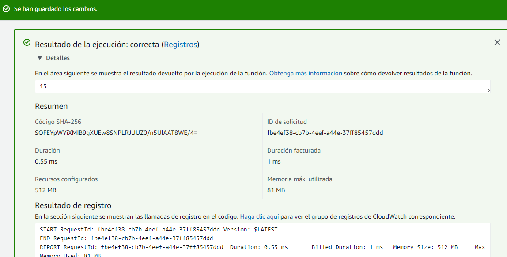

##  Creación de la API REST

Iniciamos con la creacion de *API Gateway* seleccionando en el dashboard *Api REST* y en seguida seleccionamos la opcion *crear*

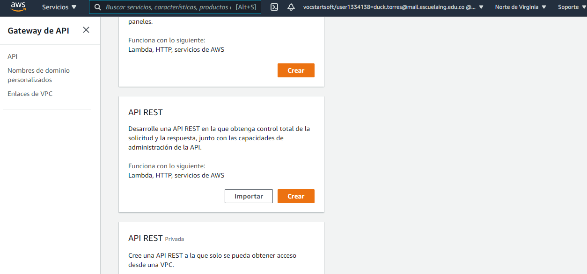

daremos aceptar y colocaremos el nombre de la api y el tipo de enlace en regional despues en crear api

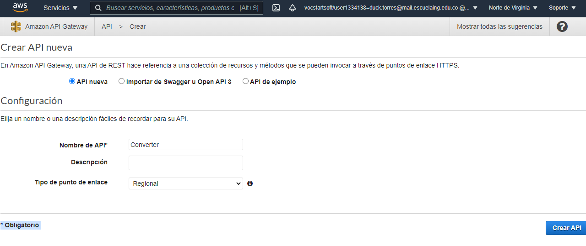

Damos en Acciones y seleccionamos crear metodo, luego colocamos get y configuramos el metodo y guardar.

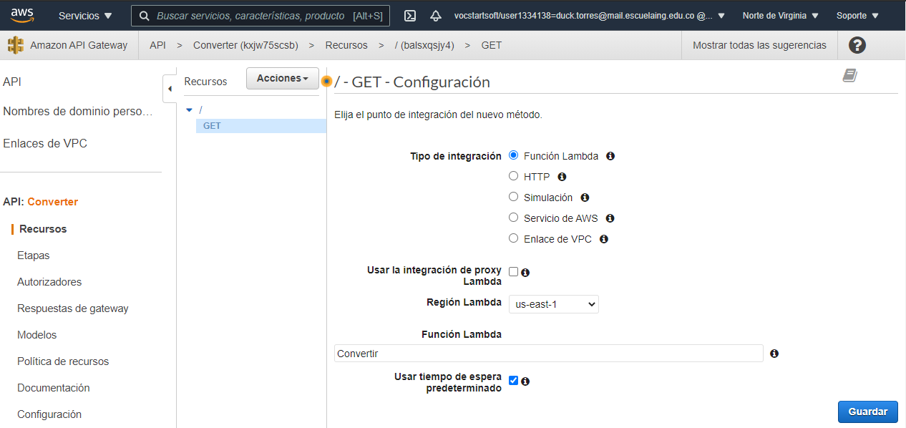

Vamos a solicitud de metodo 

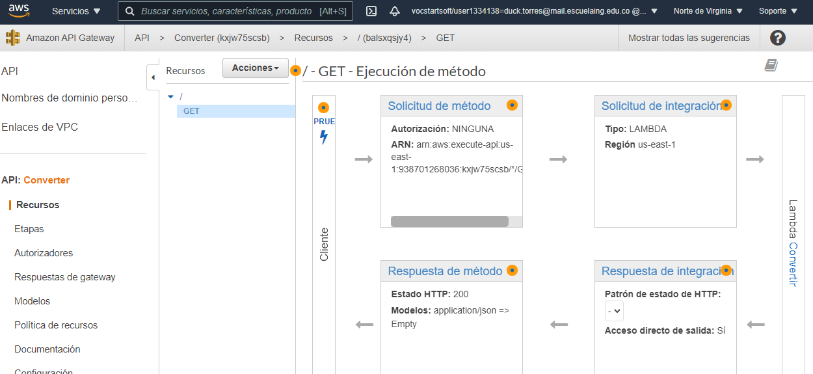

configuramos adicionando value al parametro de consulta

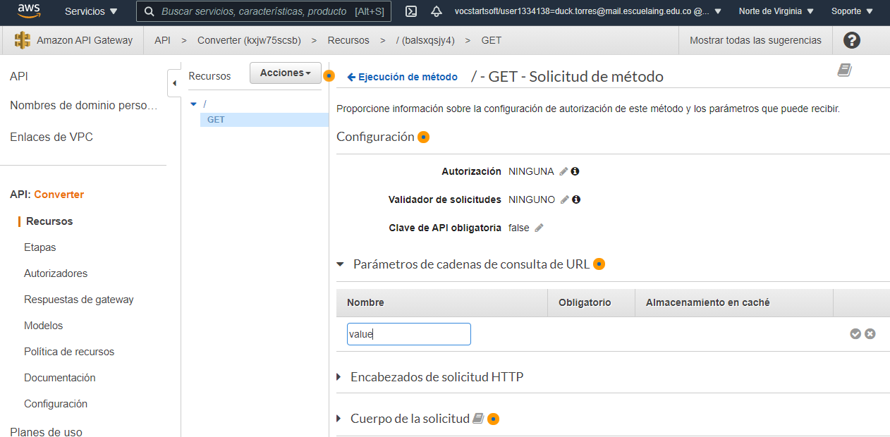

Ahora nos devolvemos e ingresamos en solicitud de integracion e ingresamos a cadenas de consulta colocando de nuevo value y method.request.querystring.value en mapeado

ingresamos a plantillas de mapeo y allli pondremos el recomendado y adicional application/json en  content type y en la parte de codigo pondremos $input.params("value") para leer nuestros valores

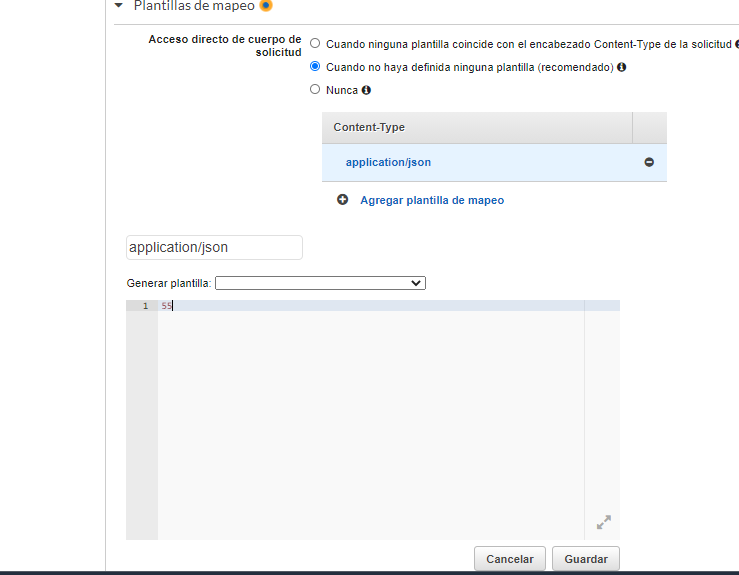

realizamos algunas pruebas en pruebas de metodos

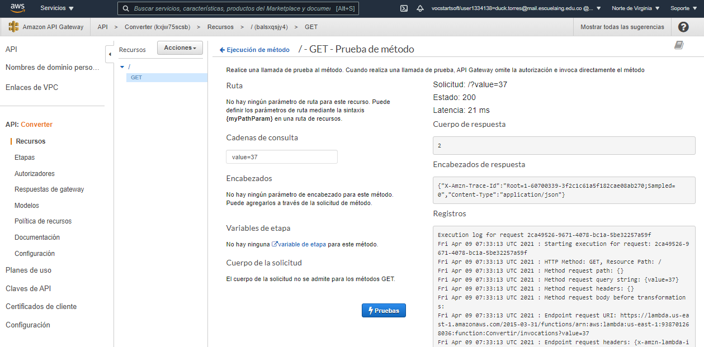

Daremos en acciones y posteriormente a implentar api colocando en etapa como nueva etapa y colocamos la fase,

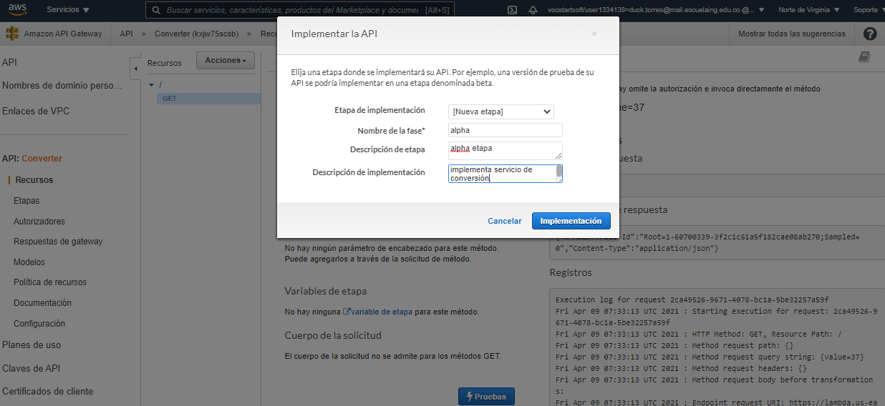

Esto nos dara nuestra etapa y su url para su uso.

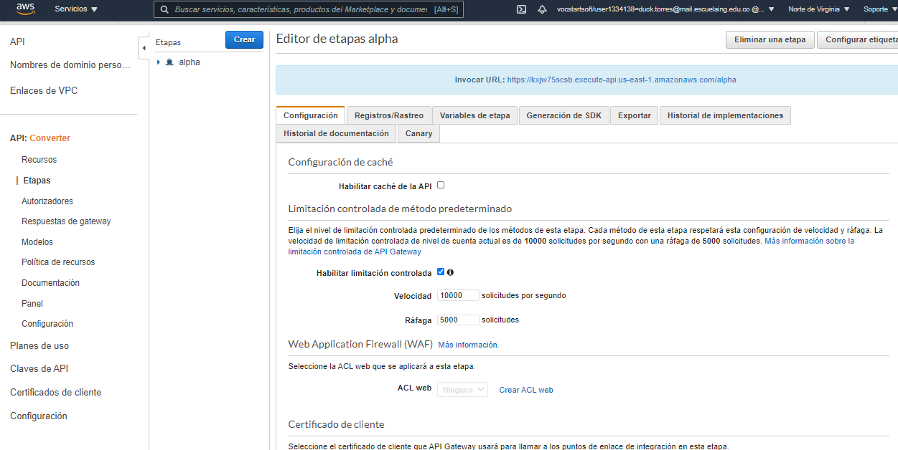

prueba

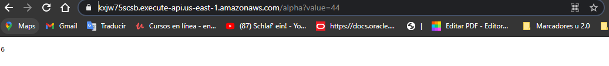

nuestra pagina 


